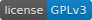

snowfox-libvireg
================
[](LICENSE)
[](https://travis-ci.org/snowfox-project/snowfox-libvireg)

<p align="center"> 

</p>

### What?
A C++ **lib**rary providing **vi**rtual **reg**isters for automated testing of low-level hardware driver code.

## Build/Install
### Install prerequisites
```
sudo apt-get install cmake
```

### Clone repository
```
git clone https://github.com/snowfox-project/snowfox-libvireg
cd snowfox-libvireg
```

### Copy and edit configuration
```
cp config/atmega328p-default.cmake config.cmake
vim config.cmake
```

### Build
```
mkdir build && cd build
cmake ..
make
```

